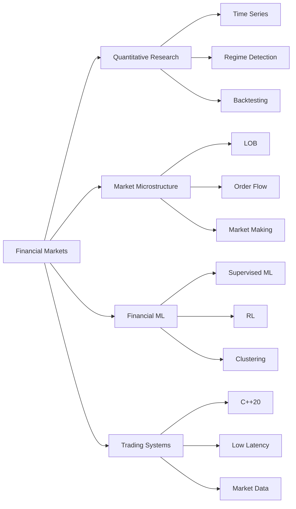

<div align="center">

# Akshay Bande

### AI Engineer · Quantitative Research · Algorithmic Trading · C++20 Systems

<a href="https://git.io/typing-svg">
  
</a>

<br>

[](https://github.com/theakshaybande)


</div>

---

## Profile

AI and quantitative-finance engineer with **6+ years of software and financial-systems experience** and an **MSc in Artificial Intelligence from Maastricht University**.

My work sits at the intersection of:

**Machine Learning · Quantitative Research · Financial Time Series · Market Microstructure · Algorithmic Trading · High-Performance C++**

I build research and engineering artifacts around real financial problems, from regime-conditioned time-series analysis and systematic trading research to limit-order books, matching engines, market-data infrastructure, reinforcement learning, and performance-oriented C++ systems.

---

## At a Glance

| | Focus |
|---|---|
| **Quant Research** | Financial time series · Regime detection · Backtesting · Statistical modeling · Risk analysis |
| **Financial ML** | PyTorch · scikit-learn · XGBoost · Clustering · Reinforcement learning |
| **Market Microstructure** | Limit order books · Matching engines · Order flow · Liquidity · Market making |
| **Low-Latency Engineering** | C++20 · Atomics · Concurrency · Memory pools · Cache-aware design · Branch prediction |
| **Production Systems** | 6+ years across financial platforms, enterprise systems, databases, and transaction processing |
| **Research Domain** | Crypto · FX · Equity indices · Volatility · Investment research |

---

# Experience

### Catella Investment Management
**Data Science Intern · Investment Research**  
*Netherlands · 2025*

- Conducted data-science and investment-research work within an asset-management environment.
- Developed a European **climate-risk clustering pipeline** combining hazard, exposure, and vulnerability indicators across **1,304 regions**.
- Produced **8- and 10-cluster regional typologies**, reaching **0.2112 ARI** and **0.3187 NMI**, with SHAP-based interpretation and interactive analysis.
- Applied unsupervised learning to investment, ESG, regional, and client data.

<br>

### Volkswagen Group Technology Solutions
**Senior Developer · Enterprise Systems**  
*Pune, India · Mar 2023 - Jul 2024*

- Developed high-throughput **SAP HANA** systems supporting global vehicle operations.
- Optimized query latency, throughput, and production reliability across performance-sensitive database logic and enterprise pipelines.
- Engineered production systems where correctness, observability, scalability, and operational reliability were critical.

<br>

### Accenture & Invenio LSI
**Developer · Financial Systems**  
*India / Bahrain · Oct 2018 - Mar 2023*

- Designed and deployed financial calculation and transaction-processing engines supporting government taxation systems handling **millions of transactions**.
- Worked across taxation platforms spanning **Bahrain, Saudi Arabia, Qatar, and Fiji**.
- Received **Best Performer** recognition for pioneering work on the Bahrain Integrated Tax System.

---

# MSc Research

## Multivariate Motif Discovery in Financial Time Series

**Maastricht University · MSc Artificial Intelligence · 2024 - 2026**

> **Regime-Agnostic and Regime-Conditioned Methods Under Nonstationarity**

[](https://github.com/theakshaybande/Final_master_thesis)

Research into recurrent structures in nonstationary financial markets using regime-aware and regime-agnostic motif discovery.

### Methods

- **Matrix Profile / STUMPY** for fixed-length motif discovery
- **LoCoMotif** for variable-length motif discovery
- **Gaussian Hidden Markov Models** for latent-state detection
- **Volatility quantile regimes** for observable market-state conditioning
- Multivariate feature representations
- Statistical evaluation under financial nonstationarity

### Research Universe

`BTC` · `ETH` · `S&P 500` · `NASDAQ 100` · `DAX` · `EUR/USD` · `GBP/USD` · `VIX`

### Scale

Research pipeline operated across datasets containing **73M+ regime-labelled observations**, multiple asset classes, multiple sampling frequencies, and both observable and latent market-state representations.

---

# Quant & HFT Engineering

<table>
<tr>
<td width="50%" valign="top">

### 🔬 [Regime-Conditioned Motif Discovery](https://github.com/theakshaybande/Final_master_thesis)

**Python · STUMPY · LoCoMotif · HMM · Time Series**

MSc research benchmarking regime-agnostic and regime-conditioned motif discovery under financial nonstationarity.

**Focus**

`Motifs` `Regimes` `HMM` `Matrix Profile` `Crypto` `FX` `Indices`

</td>

<td width="50%" valign="top">

### 📈 [ML for Market Making](https://github.com/theakshaybande/ML-MarketMaking-XGBoost)

**Python · XGBoost · Random Forest · Neural Networks**

Short-horizon EUR/USD signal-research pipeline with feature engineering, PCA, ML model comparison and backtesting.

**Reported test result**

`9.4% return` · `6% market exposure`

</td>
</tr>

<tr>
<td width="50%" valign="top">

### ⚡ [Lock-Free-Oriented Limit Order Book](https://github.com/theakshaybande/lockfree-limit-order-book)

**C++20 · LOB · Memory Pools · Cache-Aware Design**

Deterministic price-time-priority order book with direct order-ID indexing, fixed-capacity memory pools and no per-order heap allocation on critical paths.

**Focus**

`Latency` `Memory` `Cache` `Order Matching`

</td>

<td width="50%" valign="top">

### ⚙️ [Branchless Matching Engine](https://github.com/theakshaybande/branchless-matching-engine)

**C++20 · Matching Engine · Microbenchmarking**

Research implementation comparing conventional branching with branchless-style matching over deterministic synthetic order flow.

Includes a **1,000,000 order-pair benchmark** and explicit analysis of branch-prediction effects.

</td>
</tr>

<tr>
<td width="50%" valign="top">

### 📡 [C++20 Market Data Pipeline](https://github.com/theakshaybande/cpp20-market-data-pipeline)

**C++20 · Atomics · string_view · from_chars · CMake**

Low-overhead market-data parsing and processing scaffold focused on tokenization, normalization, aggregation and concurrency-oriented systems design.

**Focus**

`Market Data` `Parsing` `Atomics` `Low Allocation`

</td>

<td width="50%" valign="top">

### 🌐 [Market Chaos Lab](https://github.com/theakshaybande/market-chaos-lab)

**C++20 · Agent-Based Markets · LOB · Microstructure**

Order-driven market simulator where momentum, mean-reversion, and random trader archetypes interact through shared liquidity.

Market behavior emerges through an explicit limit-order-book matching process.

</td>
</tr>

<tr>
<td width="50%" valign="top">

### 🤖 [HFT Reinforcement Learning Trader](https://github.com/theakshaybande/hft-rl-trader)

**Python · PyTorch · Gymnasium · DQN**

Experimental reinforcement-learning environment for inventory management and quote placement within a stylized limit-order-book market.

**Model includes**

`Inventory Risk` `Spread` `Fees` `PnL` `Reward Design`

</td>

<td width="50%" valign="top">

### 📊 Systematic Trading Research

**Python · Backtesting · Execution · Transaction Costs**

Research infrastructure around signal validation, execution assumptions, transaction costs, market regimes and systematic strategy development.

**Focus**

`Signals` `Backtesting` `Slippage` `Risk` `Execution`

</td>
</tr>
</table>

---

# Technical Stack

### Languages


### Machine Learning & Research


### Systems & Infrastructure


---

## Core Competencies

```text
QUANTITATIVE RESEARCH
├── Financial Time Series
├── Statistical Modeling
├── Regime Detection
├── Backtesting
├── Transaction Costs
└── Risk Analysis

MARKET MICROSTRUCTURE
├── Limit Order Books
├── Matching Engines
├── Market Data
├── Order Flow
├── Liquidity
├── Execution
└── Market Making

LOW-LATENCY C++
├── C++17 / C++20
├── STL
├── Atomics
├── Concurrency
├── Memory Management
├── Lock-Free Concepts
├── Cache-Aware Design
└── Branch Prediction

FINANCIAL ML
├── Supervised Learning
├── Unsupervised Learning
├── Deep Learning
├── Reinforcement Learning
├── Regime Modeling
└── Multivariate Time Series
```

---

# Selected Academic Research

| Project | Research Area |
|---|---|
| [**Quantum Trend**](https://github.com/theakshaybande/Quantum_trend) | Quantitative academic research |
| [**Crypto Time-Series Motifs**](https://github.com/theakshaybande/crypto-time-series-motifs) | Financial data ingestion and motif research |
| [**Climate Modeling**](https://github.com/theakshaybande/climate-modeling) | Unsupervised learning and regional modeling |

---

# Current Research & Engineering Focus



---

# Engineering Activity

<div align="center">


<br>


</div>

<br>

<div align="center">


</div>

---

# What I Am Building Toward

I am interested in engineering and research problems where **machine intelligence, quantitative methods, high-performance computing, and real financial markets intersect**.

<div align="center">

### Quantitative Research · Quant Development · Algorithmic Trading
### Financial ML · Market Microstructure · Low-Latency Trading Systems

<br>

> **Build. Measure. Research. Iterate.**

<br>

[](https://github.com/theakshaybande)

</div>
